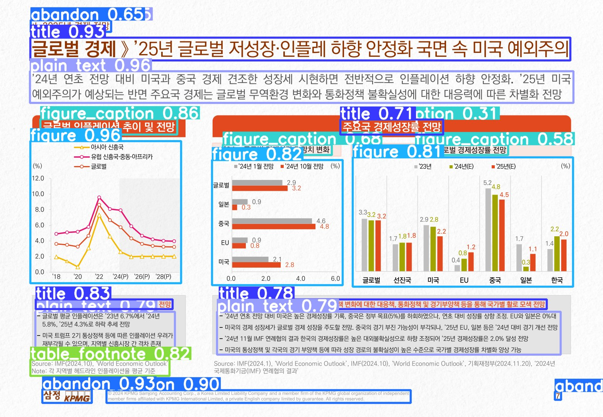
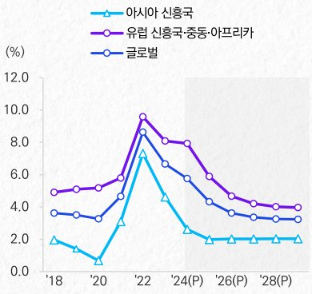
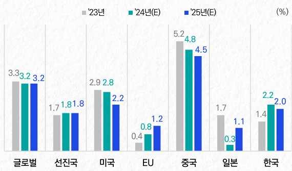

# 📄 ollamaparser

**고급 PDF 문서 파싱 시스템** — Layout Detection + OCR + Vision Language Model(VLM)을 결합하여 PDF를 지능형 구조화 문서로 변환

## 🎯 프로젝트 개요

복잡한 레이아웃의 PDF 문서를 자동으로 이해하고 **구조화된 Markdown**으로 변환합니다.

- 📐 **정확한 레이아웃 분석** — YOLO 기반 요소 감지
- 🔤 **고품질 텍스트 추출** — 딥러닝 OCR
- 🎨 **이미지 자동 해석** — 차트/그래프 분석
- 🧠 **지능형 읽기 순서** — 자연스러운 문서 흐름
- ⚡ **고성능 병렬 처리** — ThreadPoolExecutor 활용

---

## ⚙️ 핵심 메커니즘 (5단계)

### 1️⃣ **레이아웃 감지 (Layout Detection)**

```
PDF 페이지 이미지 → DocLayout-YOLO → 요소 분류 및 위치 파악
```

**역할:**
- 각 페이지에서 의미있는 모든 요소 자동 감지
- 감지 요소: 제목, 본문, 표, 차트, 이미지, 주석, 캡션 등
- 각 요소의 **Bounding Box(좌표), 타입, 신뢰도** 산출

**출력 예시:**
```json
{
  "type": "figure",
  "bbox": {"left": 100, "top": 200, "right": 500, "bottom": 400},
  "confidence": 0.95
}
```

---

### 2️⃣ **읽기 순서 추론 (Reading Order)**

```
감지된 요소 위치 → K-means 컬럼 클러스터링 → 자연스러운 순서 결정
```

**알고리즘:**
1. **Y좌표 기반 클러스터링** — 행(row) 자동 감지
2. **행 내 정렬** — X좌표로 좌→우 정렬
3. **행 간 정렬** — 위→아래 순서 확정

**다단 레이아웃 처리:**
```
신문/잡지 2단 레이아웃:
[왼쪽 상단] → [오른쪽 상단] → [왼쪽 하단] → [오른쪽 하단]
```

---

### 3️⃣ **텍스트 추출 (OCR)**

```
이미지 영역 → DeepSeek-OCR (Ollama) → 고정확도 텍스트
```

**특징:**
- **한글/영문 혼합** 문서 완벽 지원
- **할루시네이션 필터링** — 부정확한 OCR 결과 자동 제거
- **포맷 유지** — 표, 코드 블록 등 마크다운 포맷 보존

---

### 4️⃣ **시각 콘텐츠 해석 (VLM)**

```
차트/그래프 이미지 → Gemma3/Qwen3-VL → 자동 해석 및 요약
```

**분석 항목:**
- **요약** — 이미지의 핵심 내용 요약
- **핵심 포인트** — 주요 수치 및 트렌드
- **주의사항** — 특별히 주목할 점

**출력 구조:**
```
- 요약: 글로벌 인플레이션은 2022년 정점을 찍은 후 하락 추세...
- 핵심:
  1. 2022년 8% 초과
  2. 2024년 3% 수준 예상
- 주의: 미국 정책 변화 주시 필요
```

---

### 5️⃣ **병렬 처리 (Parallel Execution)**

```
여러 요소의 OCR/VLM 작업 → ThreadPoolExecutor로 동시 실행
```

**세 가지 실행 모드:**

| 모드 | 특징 | 사용 시점 |
|------|------|----------|
| **Parallel** | 모든 OCR/VLM 동시 실행 | 고속 처리 필요, 충분한 메모리 |
| **Grouped** | OCR 완료 후 VLM | 메모리 효율성 우선 |
| **Interleaved** | 요소별 OCR→VLM 순차 | 균형잡힌 성능 |

---

## 🚀 핵심 기능 요약

✅ **정확한 레이아웃 분석** — DocLayout-YOLO로 테이블, 텍스트, 차트, 이미지 자동 감지
✅ **고품질 OCR** — DeepSeek-OCR (Ollama) 기반 한글/영문 혼합 문서 지원
✅ **지능형 VLM 해석** — Gemma3/Qwen3-VL로 차트·그림·도표 자동 분석 및 요약
✅ **자연스러운 읽기 순서** — K-means 기반 다단 레이아웃 처리
✅ **고성능 병렬 처리** — ThreadPoolExecutor로 OCR/VLM 작업 동시 실행

---

## 📊 전체 처리 흐름

```
PDF 파일
  │
  ├─► [Step 1] PDF 렌더링
  │   └─ pypdfium2로 페이지 이미지 생성
  │   └─ 텍스트 레이어 추출
  │
  ├─► [Step 2] 레이아웃 감지
  │   └─ DocLayout-YOLO로 요소 감지
  │   └─ BBox + 타입 + 신뢰도 산출
  │
  ├─► [Step 3] 감지 결과 필터링
  │   └─ 신뢰도 임계값 필터링
  │   └─ IoU 기반 중복 제거
  │
  ├─► [Step 4] 읽기 순서 추론
  │   └─ K-means 클러스터링
  │   └─ 자연스러운 순서 결정
  │
  ├─► [Step 5] OCR/VLM 처리 (병렬/순차)
  │   ├─ OCR: 텍스트 영역 추출
  │   ├─ VLM: 이미지 분석
  │   └─ Ollama 서버 호출
  │
  ├─► [Step 6] 텍스트 정제
  │   └─ 할루시네이션 필터링
  │   └─ HTML → Markdown 변환
  │
  └─► [Step 7] 출력 생성
      ├─ out.md (마크다운)
      ├─ out.meta.json (메타데이터)
      ├─ pages/ (렌더링 이미지)
      ├─ crops/ (VLM용 이미지)
      └─ detections/ (감지 결과 시각화)
```

---

## 📋 실제 처리 예시

### 레이아웃 감지 결과

DocLayout-YOLO가 PDF 페이지에서 자동으로 요소를 감지한 결과:



**감지된 요소들:**
- `title` (0.93) - 페이지 제목
- `plain_text` (0.96) - 본문 텍스트
- `figure` (0.96, 0.82, 0.81) - 차트/그래프 영역
- `figure_caption` (0.86, 0.68, 0.58) - 그림 캡션
- `table_footnote` (0.82) - 출처/각주
- `abandon` (0.65, 0.93, 0.90) - 무시할 영역 (로고, 페이지 번호 등)

### VLM 차트 해석

#### 글로벌 인플레이션 추이 차트


**VLM 해석 결과:**
```
- 요약: 글로벌 인플레이션은 2022년 정점을 찍은 후 둔화 추세이며, 
       2025년까지 하향 안정화될 것으로 전망됩니다.
- 핵심:
    1. 2022년 글로벌 인플레이션은 8%를 넘는 최고점을 기록
    2. 2024년 이후 인플레이션은 3% 수준으로 하락 예상
    3. 아시아 신흥국 > 유럽 신흥국 > 글로벌 순으로 인플레이션 수준
- 주의: 2025년 미국의 정책 변화가 주요국 경제에 영향 가능
```

#### 주요국 경제성장률 전망 차트


**VLM 해석 결과:**
```
- 요약: 2025년 글로벌 경제 성장률은 주요국의 통상정책 변화 대응에 따라 
       차별화될 것으로 예상됩니다.
- 핵심:
    - 중국: 5.2% → 4.8% → 4.5% (하락 추세)
    - 미국: 2.9% → 2.8% → 2.2%
    - 한국: 1.4% → 2.2% → 2.0%
- 주의: 국가별 경제성장 전망치에 큰 차이 존재
```

### 최종 Markdown 출력 (일부)

```markdown
# Parsed Document

## Page 8

글로벌 경제 — '25년 글로벌 저성장·인플레 하향 안정화 국면 속 미국 예외주의

'24년 연초 전망 대비 미국과 중국 경제 건조한 성장세 시현하면 전반적으로 
인플레이션 하향 안정화. '25년 미국 예외주의가 예상되는 반면 주요국 경제는 
글로벌 무역환경 변화와 통화정책 불확실성에 대한 대응력에 따른 차별화 전망

## 글로벌 인플레이션 추이 및 전망


**이미지 해석:**
- 요약: 글로벌 인플레이션은 2022년 정점을 찍은 후 둔화 추세...
- 핵심: ...
- 주의: ...
```

---

## 🏗️ 시스템 아키텍처

### 컴포넌트 관계도

```
┌───────────────────────────────────────────────────────────────┐
│                       ollamaparser                             │
├───────────────────────────────────────────────────────────────┤
│                                                                │
│  Input Layer:                                                 │
│  ├─ pdf_render.py      ──► Pages → Images                    │
│  ├─ detectors.py       ──► Layout Detection                  │
│  └─ detection_filter.py ──► Filter & Clean                   │
│                                                                │
│  Processing Layer:                                            │
│  ├─ layout_order.py     ──► Reading Order (K-means)          │
│  ├─ ocr_vlm.py          ──► Task Execution (Parallel/Seq)   │
│  └─ providers/          ──► Ollama Integration               │
│                                                                │
│  Output Layer:                                                │
│  ├─ text_clean.py       ──► Clean Text                       │
│  ├─ markdown_writer.py  ──► Generate Markdown               │
│  └─ metadata.py         ──► Generate Metadata               │
│                                                                │
└───────────────────────────────────────────────────────────────┘
```

### 데이터 흐름

```
PDF File
  ↓ [pdf_render.py]
  └─→ PageAsset[] {image, text, size}
       ↓ [detectors.py]
       └─→ DetectedElement[] {bbox, type, confidence}
            ↓ [detection_filter.py]
            └─→ Filtered Elements {confidence > threshold}
                 ↓ [layout_order.py]
                 └─→ Sorted Elements {reading order}
                      ↓ [ocr_vlm.py]
                      ├─→ OCR Results {text}
                      └─→ VLM Results {interpretation}
                           ↓ [text_clean.py]
                           └─→ Cleaned Text
                                ↓ [markdown_writer.py]
                                └─→ out.md, out.meta.json
```

---

## 📁 모듈별 상세 설명

### 1️⃣ 핵심 타입 정의

| 파일 | 역할 |
|------|------|
| `types.py` | `PageAsset` — 렌더링된 페이지 (이미지 경로, 크기, 텍스트) |
| `layout_types.py` | `BBox`, `DetectedElement` — 감지 결과 (좌표, 타입, 신뢰도) |

### 2️⃣ PDF 처리

| 파일 | 역할 | 기능 |
|------|------|------|
| `pdf_render.py` | 렌더링 | PDFium 기반 고해상도 이미지 변환 |

**프로세스:**
```python
render_pdf_pages(pdf_path, dpi=150)
├─ 각 페이지를 이미지로 변환
├─ 텍스트 레이어 추출 (가능한 경우)
└─ PageAsset[] 반환
```

### 3️⃣ 레이아웃 감지

| 파일 | 역할 | 기능 |
|------|------|------|
| `detectors.py` | 감지 | DocLayout-YOLO 기반 요소 감지 |
| `detection_filter.py` | 필터링 | IoU 중복 제거, 신뢰도 필터링 |

**필터링 알고리즘:**
```python
1. 신뢰도 필터링 (confidence < threshold 제거)
2. IoU 기반 중복 제거 (겹침 > threshold 시 높은 신뢰도만 유지)
3. 주변 컨텍스트 추출 (VLM 입력용)
```

### 4️⃣ 읽기 순서 추론

| 파일 | 역할 |
|------|------|
| `layout_order.py` | K-means 기반 행 클러스터링 및 순서 결정 |

**알고리즘:**
```
1단계: Y좌표 → K-means 클러스터링 (행 그룹화)
2단계: 각 행 내 X좌표 정렬 (좌→우)
3단계: 행 간 순서 확정 (위→아래)
```

### 5️⃣ OCR/VLM 실행

| 파일 | 역할 |
|------|------|
| `ocr_vlm.py` | TaskExecutor — 병렬/순차 작업 실행 |

**실행 모드:**
```python
- execute_parallel()  ──► 모든 작업 동시 실행 (빠름)
- execute_sequential() ──► OCR→VLM 순차 (메모리 효율)
- execute_interleaved() ──► 요소별 순차 (균형)
```

### 6️⃣ 제공자 (Providers)

| 파일 | 역할 |
|------|------|
| `providers/base.py` | Protocol 정의 (OCRModel, VisionLanguageModel) |
| `providers/ollama/client.py` | Ollama HTTP 클라이언트 |
| `providers/ollama/ocr.py` | OCR 구현 (DeepSeek-OCR 지원) |
| `providers/ollama/vlm.py` | VLM 구현 (Gemma3/Qwen3-VL 지원) |

**Ollama 통신:**
```
Python Client → HTTP /api/generate → Ollama Server
                                    ├─ deepseek-ocr (OCR_MODEL)
                                    ├─ gemma3:27b (VLM_MODEL)
                                    └─ qwen3-vl:30b (VLM_MODEL)
```

**모델 구성:**
- `OCR_MODEL` 환경 변수로 OCR 모델 변경 가능
- `VLM_MODEL` 환경 변수로 VLM 모델 변경 가능
- `.env` 파일에서 기본값 설정 가능

### 7️⃣ 후처리

| 파일 | 역할 |
|------|------|
| `text_clean.py` | 텍스트 정제 (할루시네이션 필터, HTML→MD) |
| `quality_check.py` | 품질 분석 (겹침, 빈 영역 등) |

### 8️⃣ 출력 생성

| 파일 | 역할 |
|------|------|
| `markdown_writer.py` | Markdown 빌더 (final/debug 스타일) |
| `metadata.py` | 메타데이터 JSON 생성 |

---

## 🔧 설치

```bash
# 기본 설치
uv sync

# DocLayout-YOLO 포함 설치
uv sync --extra detector
```

### 요구사항

- Python 3.10+
- [Ollama](https://ollama.ai/) (로컬 LLM 서버)

```bash
# Ollama 모델 다운로드
ollama pull deepseek-ocr
ollama pull gemma3:27b
# 또는
ollama pull qwen3-vl:30b
```

### 환경 설정 (.env)

프로젝트 루트에 `.env` 파일을 생성하여 모델을 구성할 수 있습니다:

```bash
# .env 파일 예시
OCR_MODEL=deepseek-ocr:latest
VLM_MODEL=gemma3:27b
OLLAMA_HOST=http://localhost:11434
```

**환경 변수:**
- `OCR_MODEL`: OCR에 사용할 모델 (기본값: `deepseek-ocr:latest`)
- `VLM_MODEL`: VLM에 사용할 모델 (기본값: `gemma3:27b`)
- `OLLAMA_HOST`: Ollama 서버 주소 (기본값: `http://localhost:11434`)

**모델 변경 예시:**

```bash
# 다른 OCR 모델 사용
OCR_MODEL=custom-ocr:v2 uv run ollamaparser-parse --pdf document.pdf --out_dir ./output

# 다른 VLM 모델 사용
VLM_MODEL=qwen3-vl:30b uv run ollamaparser-parse --pdf document.pdf --out_dir ./output

# 원격 Ollama 서버 사용
OLLAMA_HOST=http://192.168.1.100:11434 uv run ollamaparser-parse --pdf document.pdf --out_dir ./output
```

---

## 💻 사용법

### 기본 실행

```bash
uv run ollamaparser-parse \
  --pdf "document.pdf" \
  --out_dir ./output \
  --detector doclayout-yolo \
  --yolo-weights "juliozhao/DocLayout-YOLO-DocStructBench" \
  --yolo-from-pretrained \
  --ocr-provider deepseek-ollama \
  --ocr-scope elements \
  --vlm-provider ollama-vlm \
  --vlm-scope visuals \
  --execution-mode parallel
```

### 주요 옵션

#### Detector 옵션
| 옵션 | 설명 |
|------|------|
| `--detector` | `doclayout-yolo` / `pdfium-text` / `fallback` |
| `--yolo-weights` | YOLO 가중치 경로 또는 HF repo_id |
| `--yolo-from-pretrained` | HuggingFace에서 가중치 다운로드 |
| `--save-detections` | 감지 결과 이미지/JSON 저장 |

#### OCR 옵션
| 옵션 | 설명 |
|------|------|
| `--ocr-provider` | `none` / `deepseek-ollama` |
| `--ocr-scope` | `none` / `page` / `elements` |
| `--ocr-mode` | `markdown` / `free` |
| `--figure-ocr` | 그림 영역도 OCR 수행 |

#### VLM 옵션
| 옵션 | 설명 |
|------|------|
| `--vlm-provider` | `none` / `ollama-vlm` |
| `--vlm-scope` | `none` / `page` / `visuals` |
| `--ollama-vlm-model` | `gemma3:27b` / `qwen3-vl:30b` |
| `--vlm-use-image` | VLM에 이미지 전달 |
| `--figure-vlm` | 그림 영역 VLM 해석 |

#### 실행 모드
| 옵션 | 설명 |
|------|------|
| `--execution-mode` | `grouped` / `interleaved` / `parallel` |
| `--parallel-workers` | 병렬 워커 수 (기본: 4) |

#### 출력 옵션
| 옵션 | 설명 |
|------|------|
| `--md-style` | `final` (깔끔) / `debug` (bbox 포함) |
| `--metadata/--no-metadata` | 메타데이터 JSON 생성 여부 |

---

## 📂 출력 구조

```
output/
├── pages/                    # 렌더링된 페이지 이미지
│   ├── page_0001.png
│   └── page_0002.png
├── crops/                    # VLM용 크롭 이미지
│   ├── page_0001_elem_005.jpg
│   └── page_0002_elem_012.jpg
├── detections/               # 감지 결과 (--save-detections)
│   ├── page_0001.jpg         # 바운딩박스 오버레이
│   └── page_0001.json        # 감지된 요소 JSON
├── out.md                    # 최종 Markdown 출력
├── out.meta.json             # 메타데이터 (선택)
└── run.log                   # 실행 로그
```

---

## 📦 의존성

### Core
- `pypdfium2` - PDF 렌더링
- `pillow` - 이미지 처리
- `typer` - CLI 프레임워크
- `pydantic` - 데이터 검증
- `requests` - Ollama API 호출
- `scikit-learn` - K-means 클러스터링

### Optional (detector)
- `doclayout-yolo` - DocLayout-YOLO SDK
- `huggingface-hub` - 모델 다운로드

---

## 📝 라이선스

MIT License
# ollama-document-parser
